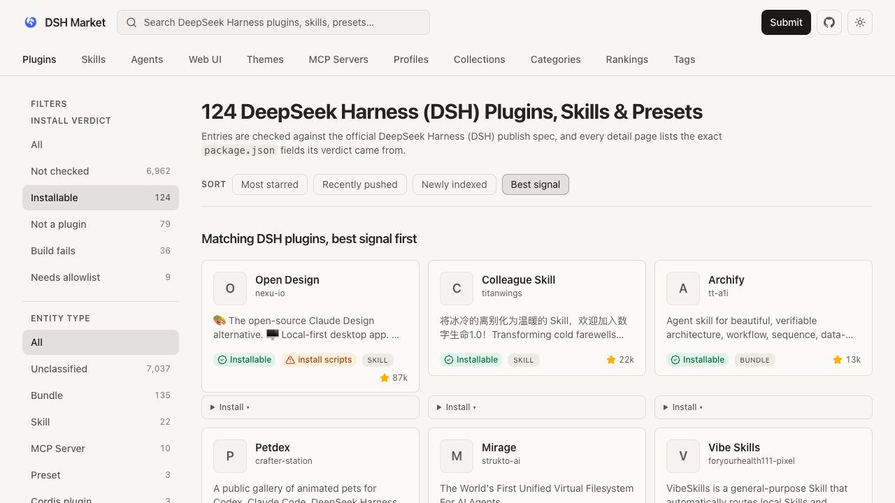

<p align="center">
  
</p>

<h1 align="center">DSH Plugin Marketplace</h1>

<p align="center"><strong>Think of it as an App Store for DSH.</strong><br>Browse, check, and install plugins from DeepSeek Harness Web without hunting for npm package names or shell commands.</p>

<p align="center">
  English · <a href="README.zh.md">中文</a> ·
  <a href="https://dshplugin.market/">Public catalog</a> ·
  <a href="https://github.com/springbrand-lab/dsh-plugin-market">GitHub</a> ·
  <a href="https://www.npmjs.com/package/@springbrand/dsh-plugin-marketplace">npm</a>
</p>

<p align="center">
  <a href="https://www.npmjs.com/package/@springbrand/dsh-plugin-marketplace"></a>
  <a href="https://github.com/springbrand-lab/dsh-plugin-market/actions/workflows/ci.yml"></a>
</p>

DeepSeek Harness (DSH) plugins are published across GitHub, npm, and community posts. This plugin adds a searchable marketplace to DSH Web settings, so you can find a plugin, see whether it is installable, and manage it from one screen.

<p align="center">
  
</p>

<p align="center"><em>Inside DSH Web: search, filter, install, update, and remove plugins.</em></p>

<p align="center">
  
</p>

<p align="center"><em>On the public catalog, check the installability verdict before you install.</em></p>

## Quick Start

The commands below work in macOS Terminal, Windows PowerShell, and Linux shells. You need the LTS version of [Node.js](https://nodejs.org/) first.

### Install from scratch

1. Install Node.js LTS, then close and reopen your terminal.
2. Install DSH and the marketplace:

   ```sh
   npm install --global pnpm @deepseek-ai/dsh
   dsh --version
   dsh plugin --profile web add @springbrand/dsh-plugin-marketplace
   dsh web
   ```

3. When DSH Web opens, go to **Settings → Plugin Marketplace**. The plugin list is ready when you can see the marketplace tabs and plugin cards.

Already have DSH installed? Skip the first command and run the remaining three commands.

### If `dsh` is not found

Close and reopen the terminal once. If the command is still unavailable, use the package runner instead:

```sh
npx @deepseek-ai/dsh plugin --profile web add @springbrand/dsh-plugin-marketplace
npx @deepseek-ai/dsh web
```

Keep the terminal open while DSH Web is running. If the browser does not open automatically, copy the local URL printed in the terminal into your browser.

<details>
<summary>Let an AI agent install it</summary>

Copy this prompt to an agent that can control your terminal, such as Codex or Claude Code:

```text
Install and start DeepSeek Harness and the SpringBrand Plugin Marketplace on this computer. Check whether Node.js LTS and dsh are available; if needed, install the official Node.js LTS and run npm install --global pnpm @deepseek-ai/dsh. Verify dsh --version, run dsh plugin --profile web add @springbrand/dsh-plugin-marketplace, then run dsh web. Confirm that Settings → Plugin Marketplace appears and report the local URL. Ask before using sudo or an administrator password, and do not handle API keys.
```

</details>

## What you can do

- Search by plugin name, owner, description, or npm package name.
- See an installability verdict and install-script warning before running third-party code.
- Choose the DSH profile where the plugin should be installed, such as `web` or `headless`.
- Install, update, and remove plugins without switching between a browser, npm, and a terminal.
- See packages already installed in a profile, even when they are not in the public catalog.

The public catalog at [dshplugin.market](https://dshplugin.market/) reads each repository's `package.json` and file list, then applies the official DSH publish rules. **Installable** means the entry passed those checks; it is not a security guarantee. Plugins are third-party code, so install only sources you trust.

If this project helps you, please give it a ⭐ Star—it helps us a lot.

## Community

- [GitHub Issues](https://github.com/springbrand-lab/dsh-plugin-market/issues) for bugs and feature requests.
- [GitHub repository](https://github.com/springbrand-lab/dsh-plugin-market) for source code and pull requests.
- [npm package](https://www.npmjs.com/package/@springbrand/dsh-plugin-marketplace) for published versions.

Discord and GitHub Discussions are not enabled yet. We will add the live links here when those community spaces are available.

## Uninstall

Remove the marketplace from the **Installed** tab in DSH Web, or run:

```sh
dsh plugin --profile web remove @springbrand/dsh-plugin-marketplace
```

## Contributing

```sh
git clone https://github.com/springbrand-lab/dsh-plugin-market.git
cd dsh-plugin-market
npm install
npm run check
```

Run `npm run check` before opening a pull request. For bug reports, include your DSH version, operating system, and reproduction steps.

<details>
<summary>Advanced configuration</summary>

Override these fields in the profile's Cordis configuration:

```yaml
config:
  profile: web
  catalogUrl: https://dshplugin.market/plugins.json
  restartDelayMs: 1500
```

- `profile`: the DSH profile used by the running process.
- `catalogUrl`: the HTTP(S) URL of the plugin catalog.
- `restartDelayMs`: the delay before restarting the active profile, from 500 to 30000 milliseconds.

</details>

## License

MIT
