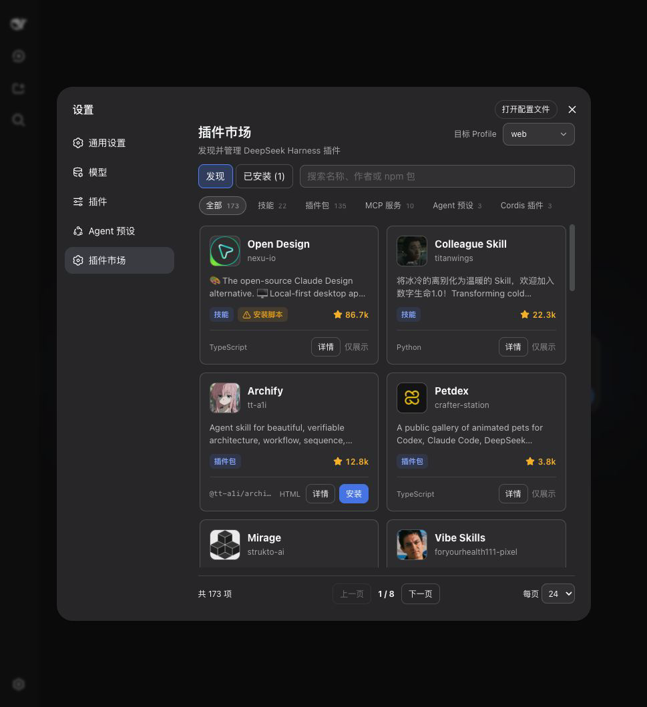

<p align="center">
  
</p>

# @springbrand/dsh-plugin-marketplace

[English](README.md) | 中文

[](https://www.npmjs.com/package/@springbrand/dsh-plugin-marketplace)
[](https://github.com/springbrand-lab/dsh-plugin-market/actions/workflows/ci.yml)

装在 DeepSeek Harness Web 设置页、并随 SpringBrand Desktop 内置的可视化插件市场。打开 **设置 → 插件市场**，即可浏览目录、搜索插件，并安装、更新或卸载插件。



## 从零开始安装

即使没有安装过 DSH，也可以按照下面步骤完成。

1. 打开 [Node.js 官网](https://nodejs.org/)，下载并安装 LTS 版本，然后关闭并重新打开终端。macOS 使用“终端”，Windows 使用 PowerShell。
2. 安装 DSH 和 pnpm：

   ```sh
   npm install --global pnpm @deepseek-ai/dsh
   ```

3. 确认 DSH 已安装：

   ```sh
   dsh --version
   ```

4. 安装插件市场：

   ```sh
   dsh plugin --profile web add @springbrand/dsh-plugin-marketplace
   ```

5. 启动 DSH Web：

   ```sh
   dsh web
   ```

保持终端窗口开启。浏览器通常会自动打开；如果没有，请打开终端中显示的 `http://127.0.0.1:端口号`。进入 **设置 → 插件市场** 即可开始使用。

如果重新打开终端后仍提示 `dsh: command not found`，请改用：

```sh
npx @deepseek-ai/dsh plugin --profile web add @springbrand/dsh-plugin-marketplace
npx @deepseek-ai/dsh web
```

## 已经安装过 DSH

```sh
dsh plugin --profile web add @springbrand/dsh-plugin-marketplace
dsh web
```

## 你会得到

- **浏览与搜索**：按名称、作者、描述或 npm 包名搜索，并显示插件分类、仓库头像和紧凑的 GitHub Star 数。
- **Profile 管理**：普通 DSH 可以在 `web`、`headless` 或其他本地 Profile 间切换目标；SpringBrand Desktop 只允许操作当前激活的 Profile。
- **一处完成安装、更新与卸载**：更新会立即解析最新发布版本；操作前显示目标 Profile 和 npm 包名，避免改错环境。
- **已安装视图**：同时展示目录插件和 Profile 中已有、但目录未收录的依赖。
- **明确的生效时机**：当前 Profile 变更后自动重启；其他 Profile 在下次启动时生效。

## 安全

- 只允许安装目录中标记为 `bundle`、`installable`、`npm` 的条目。
- 服务端会重新从目录解析 npm 包名，不接受浏览器提交任意安装源。
- 更新与卸载只接受当前 Profile 中已安装的合法 npm 包名。
- 所有变更接口只接受同源 JSON POST，请求体限制为 8 KiB。
- 普通 DSH 指令通过参数数组直接启动，不经过 shell；SpringBrand Desktop 会把操作交给自身受管的 package operation service。同一时间只执行一个插件操作。

插件属于第三方代码。目录收录不代表安全背书，请只安装你信任的来源。

## 工作方式

```text
[Web 设置页]
      |
      v
[本插件的本地 HTTP 接口]
      |
      +--> [dshplugin.market/plugins.json]
      |
      +--> 普通 DSH：dsh plugin --profile <profile> add|update|remove <package>
      |
      +--> SpringBrand Desktop：针对当前 Profile 调用 desktopPnpm.runPlugin()
```

在普通 DSH 中，市场默认操作当前运行的 Profile，也可以在页面中选择其他 Profile。SpringBrand Desktop 只暴露当前激活的 Profile，通过 `desktopPnpm` 执行 package operation，并通过 `desktopProfiles` 请求应用有序重启。该插件不提供任意 Hot-mount 或无缝端口交接。

### 哪些 Profile 会出现在目标列表里

普通 DSH 下的列表是：`web`、`headless`、本进程启动时使用的 Profile，以及 `<DSH home>/profiles` 下的每个目录，按名称排序。DSH home 取 `DSH_HOME`，未设置时为 `~/.dsh`。`profiles/node_modules` 不会作为目标出现。

Profile 在初始化之前就会出现在列表中，因此可以在 `web` 会话里直接把插件装进 `headless`，无需先创建该 Profile。**已安装**视图针对每个 Profile 读的是它自己的 `package.json` dependencies——这也是它会列出目录中没有、由本市场之外的途径安装的包的原因。

## 配置

在 Profile 的 Cordis 配置中可以覆盖：

```yaml
config:
  profile: web
  catalogUrl: https://dshplugin.market/plugins.json
  restartDelayMs: 1500
```

- `profile`：普通 DSH 进程使用的 Profile；默认从启动参数读取。SpringBrand Desktop 始终使用当前激活的 Profile。
- `catalogUrl`：插件目录 JSON 地址，必须使用 HTTP 或 HTTPS。
- `restartDelayMs`：普通 DSH 进程的重启等待时间，范围为 500–30000 毫秒。SpringBrand Desktop 自行持有重启时序。

## 卸载

可以在市场的“已安装”页面卸载，也可以运行：

```sh
dsh plugin --profile web remove @springbrand/dsh-plugin-marketplace
```

## 开发

```sh
npm install
npm run check
```

## License

MIT
